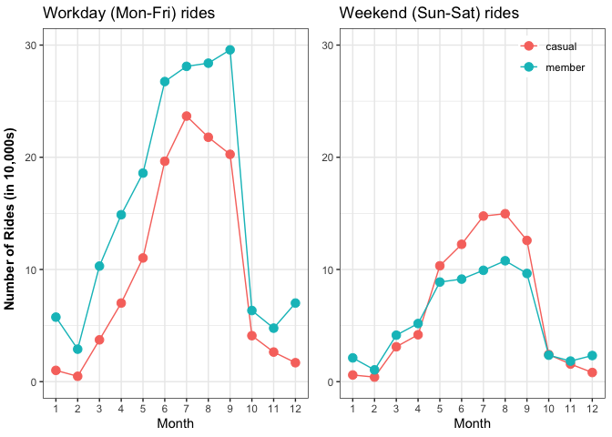

# Actionable insights from ride-share data (cleaning, analysis, and visualization with R)

The Cyclistic marketing department is developing a strategy for converting casual riders to annual members (subscribers). The analytic goals of this project are to <b> understand how annual members and casual riders use Cyclistic bikes differently and <i>why</i> casual riders might join the platform</b>. As part of their strategy, the marketing team seeks advice on using digital media to influence conversions.

The following recommendations are based on daily, hourly, and seasonal usage of the Cyclistic ridesharing platform: 

### Track Cyclistic user journeys by encouraging casual riders to sign-up using e-mail

The greatest number of rides for both casual riders and annual members are registered over the summer. There is a ~5% increase in workday monthly rides from Jul-Sep for annual members, but a ~16% decrease in casual rides over the same seasonal period. See graph below. 

<i>This trend inspires us to wonder whether there is a conversion of casual riders taking place. To validate this claim, I recommend tracking user journeys in the Cyclistic platform.</i> One way to do this is to require first-time casual riders to enter their e-mail before taking out a bike. This would allow us to track conversions by monitoring the activity of casual riders who sign up for a membership <i>at a later date with the same e-mail address</i>.

## Create e-mail newsletter and blog that highlights weekend and summer recreational events 

Whether the majority of conversions occur during the summer or not, it is evident from seasonal trends that most rides for casual and member customer types take place over the summer.

A digital media campaign based on an e-mail newsletter could keep Cyclistic users informed of bike-friendly summer events (e.g. festivals, parks, etc). 

Geospatial data reveals that riders frequently ride from bike stations near the water in the summer. In particular, Streeter Dr & Grand Ave is the most popular station during Summer and is located near Navy Pier (Chicago's premier tourist site). 

A newsletter which tells riders what's happening at Navy Pier over the weekend, and where they could bike to, could keep users engaged. 

Furthermore, promoting the newsletter through a blog for non-Cyclistic users could promote the platform to people who are trying to figure out what to do in Chicago over the weekend. This would allow us to target casual riders who registered the maximum number of rides on Saturdays. 

Considering the increased activity for members during (working) lunch hours, I also recommend the newsletter highlight the flexibility of biking to work and grabbing a bite to eat. 

## Why casual riders might convert to annual members 
It is possible that casual riders are converting to annual members over the summer and are initially drawn by the recreational use of bikes, given the decrease in casual riders and slight increase in members over Jul-Sep months, as well as the popularity of the Streeter Dr and Grand Ave station near Navy Pier. 

The monthly increase in the use of bikes at 8AM and 5PM also suggests a tendency for annual members to use bikes during work hours, while casual riders lag in the increase of ridership during traditional work hours (see graph below).

