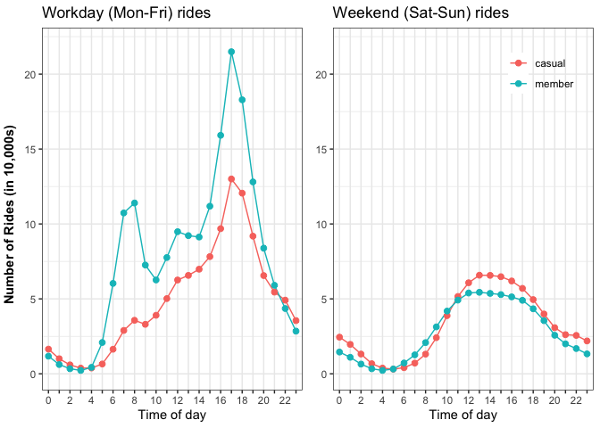

Actionable insights for Cyclistic marketing department (Google Capstone
Project)
================

# Executive Summary

Cyclistic is a rideshare platform that offers users the opportunity to
ride bikes on-demand. The Cyclistic marketing department is developing a
strategy for converting casual riders to annual members. The analytic
goals of this project are to <b> understand how annual members and
casual riders use Cyclistic bikes differently and <i>why</i> casual
riders might join the platform</b>. As part of their strategy, the
marketing team seeks advice on using digital media to influence
conversions.

<b>The purpose of this report is to provide actionable insights on over
4 million rides recorded in Cyclistic’s database</b>.

According to the data, the number of rides for annual members and casual
riders depends on various factors which could inform a robust marketing
strategy. First, the rides peak over the summer and decrease in the
winter for both groups. However, patterns in ridership over the summer
hint at casual riders converting to annual members during Jul-Sep
months. <b>To investigate the strength of this trend, I recommend
tracking user journeys from casual riders to annual members by
monitoring conversions through e-mail or credit card numbers</b>. I also
propose a digital media marketing strategy based on a newsletter, which
could be used to stimulate conversions over the summer and retain users
during winter months. Furthermore, the number of rides per day for
annual members is greatest during traditional work hours (8AM and 5PM
Mon-Fri). However, casual riders seem to prefer weekends on the basis of
number of rides per day. It’s possible these casual riders convert over
the summer, with leisure being a primary motivator (as mentioned by
marketing documentation), and these annual members choose to maximize
the benefits of their membership by riding to work.

# Data preparation and cleaning

The data was downloaded from
<a href="https://divvy-tripdata.s3.amazonaws.com/index.html"> this
webpage</a>. Divvy, a bike rideshare transportation company, published
the data online for public use. In the Google Data Analytics Capstone
Project, the data is referenced by the fictitious rideshare company
named Cyclistic.

I used Excel to remove duplicates and blank rows. The .csv files were
then converted into xlsx workbooks. Changelogs for datasets cleaned in
Excel are included in the project folder. After initial inspection of
the data and cleaning using Excel, I imported the dataset into R, where
further cleaning was done. The following code imports libraries and
cleans the data. The final clean dataset is saved as cleanData.RData,
which is loaded into the Data Analysis phase of the project.

``` r
# load libraries needed for this project
library(dplyr)
library(tidyverse)
library(lubridate)
library(ggplot2)
library(cowplot)
library(knitr)
library(readxl)
library(grid)
library(gridExtra)
```

``` r
# Import excel workbook data
trips_202010 <- read_excel("data/202010-divvy-tripdata.xlsx")
trips_202011 <- read_excel("data/202011-divvy-tripdata.xlsx")
trips_202012 <- read_excel("data/202012-divvy-tripdata.xlsx")
trips_202101 <- read_excel("data/202101-divvy-tripdata.xlsx", sheet = "202101-divvy-tripdata") #specified sheet without pivot table
trips_202102 <- read_excel("data/202102-divvy-tripdata.xlsx")
trips_202103 <- read_excel("data/202103-divvy-tripdata.xlsx")
trips_202104 <- read_excel("data/202104-divvy-tripdata.xlsx")
trips_202105 <- read_excel("data/202105-divvy-tripdata.xlsx")
trips_202106 <- read_excel("data/202106-divvy-tripdata.xlsx")
trips_202107 <- read_excel("data/202107-divvy-tripdata.xlsx")
trips_202108 <- read_excel("data/202108-divvy-tripdata.xlsx")
trips_202109 <- read_excel("data/202109-divvy-tripdata.xlsx")
```

After reading the data into R, I found there were inconsistent data
types for start\_station\_id and end\_station\_id. I reclassed them as
character types:

``` r
# Raw data had inconsistent data type of start_station_id so I classed as character
trips_202010 <- trips_202010 %>% mutate(start_station_id = as.character(start_station_id))
trips_202011 <- trips_202011 %>% mutate(start_station_id = as.character(start_station_id))
trips_202012 <- trips_202012 %>% mutate(start_station_id = as.character(start_station_id))
trips_202101 <- trips_202101 %>% mutate(start_station_id = as.character(start_station_id))
trips_202102 <- trips_202102 %>% mutate(start_station_id = as.character(start_station_id))
trips_202103 <- trips_202103 %>% mutate(start_station_id = as.character(start_station_id))
trips_202104 <- trips_202104 %>% mutate(start_station_id = as.character(start_station_id))
trips_202105 <- trips_202105 %>% mutate(start_station_id = as.character(start_station_id))
trips_202106 <- trips_202106 %>% mutate(start_station_id = as.character(start_station_id))
trips_202107 <- trips_202107 %>% mutate(start_station_id = as.character(start_station_id))
trips_202108 <- trips_202108 %>% mutate(start_station_id = as.character(start_station_id))
trips_202109 <- trips_202109 %>% mutate(start_station_id = as.character(start_station_id))

#Raw data had inconsistent data type of end_station_id so I classed as character
trips_202010 <- trips_202010 %>% mutate(end_station_id = as.character(end_station_id))
trips_202011 <- trips_202011 %>% mutate(end_station_id = as.character(end_station_id))
trips_202012 <- trips_202012 %>% mutate(end_station_id = as.character(end_station_id))
trips_202101 <- trips_202101 %>% mutate(end_station_id = as.character(end_station_id))
trips_202102 <- trips_202102 %>% mutate(end_station_id = as.character(end_station_id))
trips_202103 <- trips_202103 %>% mutate(end_station_id = as.character(end_station_id))
trips_202104 <- trips_202104 %>% mutate(end_station_id = as.character(end_station_id))
trips_202105 <- trips_202105 %>% mutate(end_station_id = as.character(end_station_id))
trips_202106 <- trips_202106 %>% mutate(end_station_id = as.character(end_station_id))
trips_202107 <- trips_202107 %>% mutate(end_station_id = as.character(end_station_id))
trips_202108 <- trips_202108 %>% mutate(end_station_id = as.character(end_station_id))
trips_202109 <- trips_202109 %>% mutate(end_station_id = as.character(end_station_id))
```

After looking at data structure and classing datatypes consistently, all
trips from past 12 months were combined into single data frame using
bind\_rows:

``` r
trips <- bind_rows(trips_202010, trips_202011, trips_202012, trips_202101, trips_202102, trips_202103,trips_202104,trips_202105, trips_202106, trips_202107, trips_202108, trips_202109)
```

\#\#Calculate ride length using difftime() function In order to prepare
data for analysis, I calculated trip ride lengths by subtracting end
from start times using the difftime function. Negative values were
excluded as shown below.

``` r
ride_length <- difftime(trips[["ended_at"]], trips[["started_at"]])# calculate ride length using difftime
trips <- mutate(trips, ride_length_all = ride_length) # insert ride length column into trips dataframe
trips_noneg <- trips[!(trips$ride_length_all<0),] #exclude negative values as a result of difftime calculation
```

I converted the result from difftime to a numeric data type for data
analysis.

``` r
# Convert difftime to numeric data type for doing calculations in the Data Analysis phase
is.difftime(trips$ride_length_all) # yields true for difftime class
trips_noneg$ride_length_all <- as.numeric(trips_noneg$ride_length_all) #cast difftime result into a numeric value
```

The rideable\_type column had three distinct categories: docked bikes,
classic bikes, and electric bikes. Classic and electric bikes are
described in the Divvy website. I tried reaching out to Divvy to clarify
exactly what a docked bike was, but they didn’t respond. As a result, I
excluded docked bikes from the analysis.

``` r
trips_noneg_nodock <- trips_noneg[!(trips_noneg$rideable_type=="docked_bike"),] # exclude docked bikes

# Disaggregate the "date" column to prepare data for analysis at different timescales
trips_noneg_nodock$date <- as.Date(trips_noneg_nodock$started_at)
trips_noneg_nodock$month <- format(trips_noneg_nodock$date,"%m")
trips_noneg_nodock$day <- format(trips_noneg_nodock$date, "%d")
trips_noneg_nodock$year <- format(trips_noneg_nodock$date,"Y")
```

Finally, the clean data was saved as cleanData.RData.

``` r
save(trips_noneg_nodock, file="cleanData.RData") # save the clean trips dataset
```

# Data analysis reveals differences in annual members and casual riders

The number of rides registered by casual riders and annual members of
the platform varies based on workday vs weekend use, season of the year,
and time-of-day. We will explore these differences in the following
sub-sections. First, let’s load the clean data:

``` r
load("./data/cleanData.RData")
```

## How do the number of rides vary depending on weekday?

Over the past 12 months, there were 4,457,992 rides recorded.
Approximately 56% of rides were initiated by annual members and 44% were
initiated by casual Cyclistic riders.

``` r
# Calculate number of rides for casual riders and annual members
rides_total <- trips_noneg_nodock %>%
  group_by(member_casual) %>% #group by bike user type and day of week
  summarise(number_of_rides = n())

# Calculate percent of casual and member rides
rides_percent <- rides_total %>%
  mutate(rides_percent = 100 * number_of_rides / sum(rides_total$number_of_rides))

# Create table for percentage of rides
kable(rides_percent)
```

| member\_casual | number\_of\_rides | rides\_percent |
| :------------- | ----------------: | -------------: |
| casual         |           1950411 |       43.75089 |
| member         |           2507581 |       56.24911 |

As we explore the daily use of bikes, we see stark differences emerge in
the number of rides when comparing annual members with casual users. The
maximum number of rides per day registered by casual riders is 419,616
and occurs over the weekend (Saturday). In contrast, the maximum number
of rides per day for annual members (382,091) occurs on a workday
(Wednesday). This trend is visualized in the following plot, with the
code used to calculate these numbers shown below.

``` r
# Add weekday column using wday()
rides <- trips_noneg_nodock %>% 
  mutate(weekday = wday(started_at, label = TRUE)) # create weekday column using wday() based on started_at column

# Compute the number of rides per day over the last 12 months
rides_per_day <- rides %>% 
  group_by(member_casual, weekday) %>% # group by bike user type and day of week
  summarise(number_of_rides = n())
```

``` r
# Plot the number of rides per day over the last 12 months
ggplot(data = rides_per_day, mapping = aes(x = weekday, y = number_of_rides/10000, group=member_casual, color=member_casual)) + 
  geom_line() + 
  geom_point(size=3) +
  labs(
    title = "Number of rides per weekday (for the past 12 months)",
    x = "Weekday",
    y = "Number of rides (x10,000)",
    colour="",
    ) +
  theme_bw() + 
  theme(legend.position=c(0.88,1.04), legend.direction="horizontal", legend.background=element_blank())  
```

<!-- -->

``` r
# When are weekly rides maximized?
rides_maxdays <- rides_per_day %>% 
  slice_max(number_of_rides) #from dplyr - shows row containing the maximum for each group (member vs casual rider)
```

``` r
# Print table that shows maximum number of rides for member and casual riders and on what day of the week this occurs
kable(rides_maxdays)
```

| member\_casual | weekday | number\_of\_rides |
| :------------- | :------ | ----------------: |
| casual         | Sat     |            419616 |
| member         | Wed     |            382091 |

The following sections provide further insight into ridership patterns
based on workday and weekend use of Cyclistic bikes. First, we explore
trip duration based on weekend vs workday use. The ride duration was
calculated by subtracting end and start times using the difftime
function.

## How long are Cyclistic rides?

The mean workday ride length/duration for casual riders was
approximately 24 minutes, and the median was \~14 minutes. In contrast,
the mean workday ride duration for casual riders was \~29 minutes and
the median was \~17 minutes. <font color="red">It should be noted,
however, that the difference in median and mean values suggests the
distribution for ride lengths is skewed positive and not normally
distributed. <b>The lack of a normal distribution for ride lengths
should be noted if decision-makers decide to follow-up with rigorous
statistical modeling</b>.</font> To provide preliminary insights, let’s
look at a visualization of casual riders and annual member
distributions.

``` r
# Filter weekend rides
rides_weekend <- rides %>%
  filter(weekday %in% as.factor(c("Sun","Sat")))

# Filter workday rides
rides_workday <- rides %>%
  filter(weekday %in% as.factor(c("Mon", "Tue", "Wed", "Thu", "Fri")))

# Edge case of zero ride length was excluded from analysis:
rides_weekend <- rides_weekend[!(rides_weekend$ride_length_all==0),]
rides_workday <- rides_workday[!(rides_workday$ride_length_all==0),]

# Calculate mean and median for weekend ride lengths
ridelength_weekend_stats <- rides_weekend %>%
  group_by(member_casual) %>%
  summarise(
    average_ride_length_weekend = mean(ride_length_all / 60),
    median_ride_length_weekend = median(ride_length_all / 60)
  )

# Calculate mean and median for workday ride lengths
ridelength_workday_stats <- rides_workday %>% 
  group_by(member_casual) %>%
  summarise(
    average_ride_length_workday=mean(ride_length_all/60), 
    median_ride_length_workday=median(ride_length_all/60)
  )
```

``` r
# Print median and mean for workday and weekend ride lengths in separate tables
kable(ridelength_weekend_stats)
```

| member\_casual | average\_ride\_length\_weekend | median\_ride\_length\_weekend |
| :------------- | -----------------------------: | ----------------------------: |
| casual         |                       28.57273 |                      17.30000 |
| member         |                       15.87864 |                      11.31667 |

``` r
kable(ridelength_workday_stats)
```

| member\_casual | average\_ride\_length\_workday | median\_ride\_length\_workday |
| :------------- | -----------------------------: | ----------------------------: |
| casual         |                       23.69279 |                     14.100000 |
| member         |                       13.47221 |                      9.683333 |

``` r
#Plot distribution of ride lengths on weekends
ridelengths_weekend <- ggplot(data = rides_weekend, mapping = aes(x = ride_length_all/60, color = member_casual)) +
  geom_freqpoly() + 
  labs(title = "Weekend (Sun-Sat) ride lengths",
       x = "Ride lengths (in minutes)"
  ) +
  theme_bw() + 
  xlim(0,120)

# Plot distribution of ride lengths over workdays
ridelengths_workday <- ggplot(data = rides_workday, mapping = aes(x = ride_length_all/60, color=member_casual)) + 
  geom_freqpoly() + 
  labs(title = "Workday (Mon-Fri) ride lengths",
       x = "Ride lengths (in minutes)"
  ) + 
  theme_bw() + 
  xlim(0,120)

# Plot the previous plots in the same graph using plot_grid()
plot_grid(ridelengths_workday,
          ridelengths_weekend,
          nrow = 2,
          align = "v",
          labels = " ")
```

<!-- -->

These density plots confirm rides are skewed toward shorter ride
lengths.

## How are ridesharing trends different, based on time-of-day and season of the year?

The number of rides per hour was also analyzed for annual members and
casual riders. On workdays, member rides increase during the hours of
8AM and 5PM, which are commonly referred to as “rush” hours for
automobile traffic. Interestingly, casual rides only increase at 5PM but
there is a relatively smaller uptick at 8AM. In the following code,
weekend rides are binned by time-of-day in one-hour increments. Each
point on the x-axis represents a bin. For example, label 1 equals
(0,1\], 2 equals (1,2\]… and so on. This was done to simplify analysis
and avoid a crowded x-axis.

``` r
# Find number of weekend rides per time of day (TOD). TOD was binned in 1 hour increments to simplify data analysis visualizations.
rides_weekend_tod <- rides_weekend %>%
  mutate(hours = as.numeric(format(started_at, "%H")) + # convert time to hours + minutes + seconds
    as.numeric(format(started_at,"%M"))/60 + 
    as.numeric(format(started_at, "%S"))/3600
        ) %>%
  mutate(binnedtime=cut(hours, breaks = seq(0,23, by = 1))) # number of rides binned by hour from 0-23

# Find number of workday rides per time of day (TOD). TOD was binned to simplify data analysis visualizations.
rides_workday_tod <- rides_workday %>%
  mutate(hours = as.numeric(format(started_at, "%H")) + # convert time to hours + minutes + seconds
    as.numeric(format(started_at,"%M"))/60 + 
    as.numeric(format(started_at, "%S"))/3600
        ) %>% 
  mutate(binnedtime=cut(hours, breaks = seq(0,23, by = 1))) # number of rides binned by hour from 0-23
```

``` r
# Compute number of rides during workdays
numrides_workday_tod <- rides_workday_tod %>%
  group_by(member_casual, binnedtime) %>%
  summarise(numrides_bin = n()) #summarise number of rides on workdays

# Compute number of rides during weekends
numrides_weekend_tod <- rides_weekend_tod %>%
  group_by(member_casual, binnedtime) %>%
  summarise(numrides_bin = n()) #summarise number of rides per hour on weekends

# Prepare labels for plot
aa=rep("",24)
aa[seq(1,24,by = 2)] = seq(0,23,by = 2) # label every other tickmark, otherwise x axis is crowded

# Plot number of workday rides per hour
workday_hours <- ggplot(data = numrides_workday_tod, mapping = aes(x = binnedtime, y=numrides_bin/10000, group=member_casual,     color=member_casual)) +
  geom_line() +
  geom_point(size=2) +
  scale_x_discrete(labels=aa) + # customize x-axis so it isn't crowded
  labs(title = "Workday (Mon-Fri) rides", 
       colour = " ",
       y = "Number of rides (in 10,000s)",
       x = "Time of day"
       ) + 
  theme_bw() + 
  theme(axis.title.y = element_blank(),
        legend.position="none") +
  ylim(0,22)

# Plot number of weekend rides per hour
weekend_hours <- ggplot(data = numrides_weekend_tod, mapping = aes(x = binnedtime, y = numrides_bin/10000, group = member_casual, color = member_casual)) +
  geom_line() +
  geom_point(size = 2) +
  scale_x_discrete(labels = aa) +
  labs(title="Weekend (Sat-Sun) rides", 
       colour=" ",
       y = "Number of rides (in 10,000s)",
       x = "Time of day"
       ) + 
  theme_bw() +
  theme(axis.title.y=element_blank(),
        legend.position = c(0.8,0.9), 
        legend.background = element_blank()
        ) + 
  ylim(0,22)

# Plot workday hours left and weekend hours on the right

monthlyrides_plot <- plot_grid(
  workday_hours,
  weekend_hours,
  nrow = 1, 
  align = "h",
  labels = " ")

# Plot workday and weekend rides with a shared Y Axis label and share scale for both plots
y.grob <- textGrob("Number of Rides (in 10,000s)", # creates y-axis label
                   gp = gpar(fontface = "bold", col = "black", fontsize = 11), 
                   rot = 90)
grid.arrange(arrangeGrob(monthlyrides_plot, left = y.grob)) # inserts shared y-axis label
```

<!-- -->

It’s also interesting that the 8AM and 5PM peak for annual member rides
is not symmetric, which one might expect from a naive adherence to
workday schedules. Furthermore, the graph on the left has a small
shoulder at the start of a typical lunch hour (12PM).

The hourly trends for casual and member rides becomes more similar over
the weekend, as seen on the right-hand panel. This distribution appears
more uniform and maximum ridership occurs around noon for both casual
and annual riders.

\#\#\#Number of workday rides per month registered at 8AM and 5PM The
following plot shows seasonal and hourly trends. The number of rides at
8AM increases more readily for annual members from Feb to Sep than for
casual riders. However, weekend rides registered by casual users
increases more rapidly from Feb to Sep. 

``` r
# Compute workday rides per month at 8AM
rides_monthly_8am <- rides_workday_tod %>%
  group_by(member_casual, month, binnedtime) %>%
  summarise(numrides_bin = n()) %>%
  filter(binnedtime == "(7,8]") #filter 8AM rides

# Plot number of workday rides per month at 8AM
plot_8am <- ggplot(data = rides_monthly_8am, mapping = aes(x = month, y = numrides_bin/10000, group = member_casual, color = member_casual)) +
  geom_line() + 
  geom_point(size = 3) + 
  labs(
    title="Workday (Mon-Fri) rides at 8AM",
    color=" ",
    x = "Month"
    ) +
  theme_bw() +
  theme(
      legend.position = c(0.2,0.95), 
      legend.direction = "vertical", 
      legend.background = element_blank(),
      axis.title.y = element_blank()
      ) +
  ylim(0,3) +
  scale_x_discrete(labels=c(1:12))

# Compute weekend rides per month at 5PM
rides_monthly_5pm <- rides_workday_tod %>%
  group_by(member_casual, month, binnedtime) %>%
  summarise(numrides_bin = n()) %>%
  filter(binnedtime=="(16,17]") #filter 5PM rides

# Plot number of workday rides per month at 5PM
plot_5pm<-ggplot(data = rides_monthly_5pm, mapping = aes(x = month, y=numrides_bin/10000, group=member_casual, color=member_casual)) +
  geom_line() +
  geom_point(size=3) +
  labs(
    title="Workday (Mon-Fri) rides at 5PM",
    color=" ",
    x = "Month"
    ) +
  theme_bw() +
  theme(
    legend.position="none",
    axis.title.y=element_blank()
    ) +
  ylim(0,3) +
  scale_x_discrete(labels=c(1:12))

# Plot number of workday rides per month side by side
#library(cowplot)
rides_8amvs5pm <- plot_grid(
  plot_8am, 
  plot_5pm, 
  nrow=1,
  align="v",
  labels=" ")

# Create a shared scale and Y-axis
y.grob <- textGrob(
  "Number of Rides (in 10,000s)", 
  gp = gpar(fontface = "bold", col = "black", fontsize = 11), 
  rot = 90)

# Plot with shared scale and y-axis
grid.arrange(arrangeGrob(rides_8amvs5pm, left = y.grob))
```

<!-- -->
It’s also interesting to note that the number of workday rides at 5PM
increases from Jul-Sep for annual members. In contrast, casual rides
decrease over the same time period.

\#\#\#Number of rides per month reveals seasonal trends The success of
our efforts to convert casual riders to annual members depends on
understanding <i>why</i> these riders become members. The seasonal data
plotted in this section hints at some potential reasons casual riders
might have when purchasing a membership. First, let’s examine how ride
usage changes on a monthly basis.

``` r
# Compute number of workday rides per month
rides_workday_month <- rides_workday %>%
  group_by(member_casual, month) %>%
  summarise(numrides = n())

# Plot number of workday rides per month
plot_month_workday <- ggplot(data = rides_workday_month, mapping = aes(x = month, y = numrides/10000, group = member_casual, color = member_casual)) +
  geom_line() + 
  geom_point(size = 3) + 
  labs(
    title="Workday (Mon-Fri) rides",
    color=" ",
    x = "Month"
    ) +
  theme_bw() +
  theme(
      legend.position = "none",
      axis.title.y = element_blank()
      ) +
  scale_x_discrete(labels=c(1:12)) + 
  ylim(0,30)

# Compute number of weekend rides per month
rides_month_weekend <- rides_weekend %>%
  group_by(member_casual, month) %>%
  summarise(numrides = n())

# Plot number of weekend rides per month
plot_month_weekend<-ggplot(data = rides_month_weekend, mapping = aes(x = month, y=numrides/10000, group=member_casual, color=member_casual)) +
  geom_line() +
  geom_point(size=3) +
  labs(
    title="Weekend (Sun-Sat) rides",
    color=" ",
    x = "Month"
    ) +
  theme_bw() +
  theme(
      legend.position = c(0.8,0.95), 
      legend.direction = "vertical", 
      legend.background = element_blank(),
      axis.title.y = element_blank()
    ) +
  scale_x_discrete(labels=c(1:12)) +
  ylim(0,30)

# Plot number of workday and weekend rides
plot_rides_month <- plot_grid(
  plot_month_workday, 
  plot_month_weekend, 
  nrow=1,
  align="v",
  labels=" ")

# Create shared y-axis 
y.grob <- textGrob(
  "Number of Rides (in 10,000s)", 
  gp = gpar(fontface = "bold", col = "black", fontsize = 11), 
  rot = 90)

# Plot both graphs with shared y-axis
grid.arrange(arrangeGrob(plot_rides_month, left = y.grob))
```

<!-- --> The
plot on the left-hand side shows the monthly number of workday rides for
casual and annual users. The plot on the right-hand side shows weekend
rides per month.

``` r
# Calculate percent change from Jul to Sep for member vs casual
rides_summer_casual <- rides_workday_month %>% 
  filter(month == "07" | month == "09") %>% 
  subset(member_casual == "casual") #filter Jul and Sep months for casual riders

rides_summer_member <- rides_workday_month %>% 
  filter(month == "07" | month == "09") %>% 
  subset(member_casual == "member") # filter Jul and Sep months for members

# Calculate percent change for casual riders from Jul-Sep
percentchange_casual <- 100 * (rides_summer_casual[2,"numrides"] -           rides_summer_casual[1,"numrides"])/rides_summer_casual[2,"numrides"]

# Calculate percent change for members from Jul-Sep
percentchange_member <- 100 * (rides_summer_member[2,"numrides"] -   rides_summer_member[1,"numrides"])/rides_summer_member[2,"numrides"]

# Rename table columns for printing out table
casual <- percentchange_casual %>% rename(casual_percentchange=numrides)
member <- percentchange_member %>% rename(member_percentchange=numrides)

# Create dataframe for tabler esults
percentchanges <- data.frame(casual, member)

# Output table from dataframe using kable
kable(percentchanges)
```

| casual\_percentchange | member\_percentchange |
| --------------------: | --------------------: |
|             \-16.8288 |              4.973018 |

From July to Sep, the number of monthly rides decreases for casual users
by \~16% but increases for annual members by\~5%. <i><b>We are inspired
to wonder whether casual riders are converting to annual members over
the summer. It would help if we had an independent way to track casual
riders who convert to annual members (e.g. tracking e-mail or credit
card numbers during conversions). </b></i> Of course, this can also be
explained by casual riders simply losing interest as the summer ends,
which is why conversions need to be monitored directly.

The right-hand plot shows the number of weekend rides per month. Notice
that weekend casual rides surpass member rides from
May-Aug. Furthermore, a trend similar to that observed on the left-hand
panel can be seen in the months of Nov-Dec, when member rides increase
and casual rides decrease from one month to the next.

# Actionable insights for marketing department

The analysis presented here reveals differences in seasonal,
time-of-day, weekly, and daily trends between casual riders and annual
members. These trends inspire us to consider the following:

1.  The greatest number of rides for both casual riders and annual
    members are registered over the summer. There is \~5% increase in
    rides from Jul-Sep for annual members and \~16% decrease in casual
    rides over the same seasonal period, which inspires us to wonder
    whether there is a conversion of casual riders taking place. But
    this needs to be investigated by tracking user journeys in the
    Cyclistic platform. One way to do this is to require first-time
    casual riders to enter their e-mail before taking out a bike. This
    would allow us to track conversions by monitoring the activity of
    casual riders who later sign up for a membership with the same
    e-mail address.

2.  Whether the majority of conversions occur during the summer or not,
    it is evident from seasonal trends that summer is preferable for
    both groups. A digital media campaign based on an e-mail newsletter
    could keep Cyclistic users informed of bike-friendly summer events
    (e.g. festivals, parks, etc). Since the number of rides per day for
    casual riders is maximized over the weekend, the benefits of biking
    to recreational summer events could be emphasized.

3.  A slight shoulder in the graph showing number of rides per hour on
    workdays suggests member riders are using bikes during their lunch
    hours. Coupling Cyclistic memberships with lunch discounts might be
    another way to engage riders.

4.  Using the same e-mail newsletter from \#2, advertising cold-weather
    biking gear or safety tips for riding during potentially hazardous
    winter months (when ridership is minimized) might keep users more
    engaged.

5.  It’s also possible that the summer season provides a funnel for
    converting casual riders to annual members, and these members then
    bike to work in order to maximize the benefits of having an annual
    Cyclistic membership. This might explain the faster rate of increase
    in 8AM rides for annual members relative to casual riders. Following
    up with recommendation \#1 would yield more concrete insights into
    this point.
