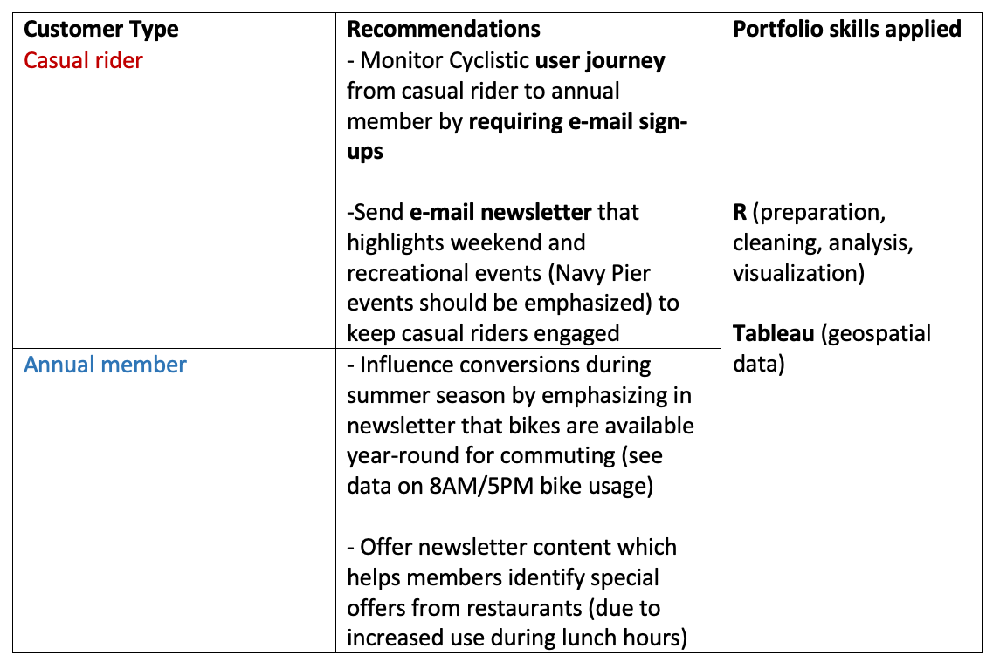
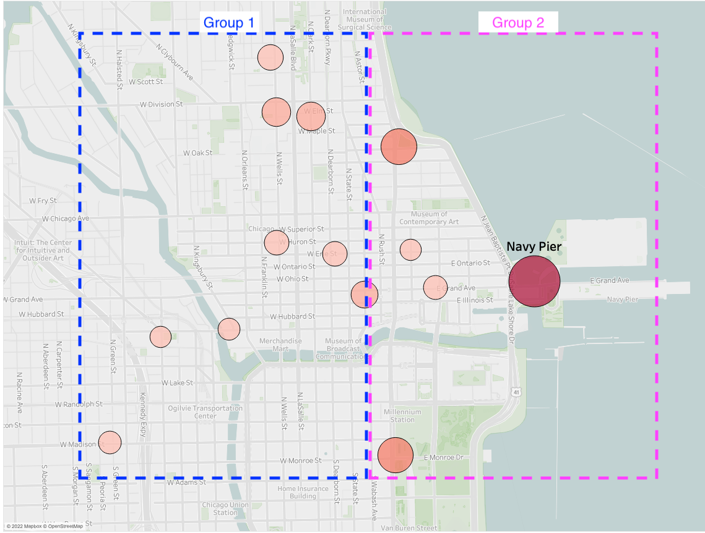

```{r setup, include=FALSE}
knitr::opts_chunk$set(echo = TRUE)
```

The Cyclistic marketing department is developing a strategy for converting casual riders to annual members (subscribers). The analytic goals of this project are to <b> understand how annual members and casual riders use Cyclistic bikes differently and <i>why</i> casual riders might join the platform</b>. As part of their strategy, the marketing team seeks advice on using digital media to influence conversions. 

For the full detailed analysis with code, see finalcode.md. Note that cyclistic_r.Rproj is a reproducible project in RStudio.

# Executive Summary of Recommendations

Here are some of the recommendations highlighted in this report:

<p align="center">
{width=100%}

<b><font color="blue"> The following sections contain expanded insights/recommendations based on daily, hourly, and seasonal usage of Cyclistic bikes</b></font>: 

# Monitor Cyclistic user journeys using e-mail sign-ups

The greatest number of rides for both casual riders and annual members are registered over the summer. There is a ~5% increase in workday monthly rides from Jul-Sep for annual members, but a ~16% decrease in casual rides over the same seasonal period. See graph below. 

<p align="center">
{width=70%}</p>

<i>This trend inspires us to wonder whether there is a conversion of casual riders taking place. To validate this claim, I recommend tracking user journeys in the Cyclistic platform.</i> One way to do this is to require first-time casual riders to enter their e-mail before taking out a bike. This would allow us to track conversions by monitoring the activity of casual riders who sign up for a membership <i>at a later date with the same e-mail address</i>.

Furthermore, notice that in May the number of casual weekend rides surpasses the number of weekend rides from annual members. In the winter, members ride more than casual riders (confirmed in the following sections).

# Why do casual riders convert to annual members?

When analyzing hourly data, we see a monthly increase in the use of bikes at 8AM and 5PM which suggests a tendency for annual members to use bikes during work hours, while casual riders lag in the increase of ridership during traditional work hours (see graph below).

<p align="center">
{width=70%}
</p>

Given the decrease in casual riders and slight increase in members over Jul-Sep months, as well as hourly trends seen above, it seems casual riders join over the summer for recreational use and, when they convert, they maximize the benefits of their membership by riding to work. 

The recreational use of bikes for casual riders is supported by the popularity of stations near Navy Pier during the summer season, explained in the following sections. 

# Create e-mail newsletter and blog that highlights weekend and summer recreational events 

Whether the majority of conversions occur during the summer or not, it is evident from seasonal trends that most rides for casual and member customer types take place over the summer.

<p align="center">
{width=70%}
</p>

A digital media campaign based on an e-mail newsletter could keep Cyclistic users informed of bike-friendly summer events (e.g. festivals, parks, etc), particularly near Navy Pier (one of Chicago's most popular tourist destinations). Navy Pier and recreational events along the coast should be highlighted given the popularity of Streeter & Grand Ave station, which is explained below.

# Which bike stations have the highest number of rides?

The following graph breaks stations down by customer type and number of riders at that station. 

The graph below shows the top 3 stations in number of casual riders:

<p align="center">
{width=90%}
</p>

Notice that Streeter Dr & Grand Ave dominates in total number of rides for casual riders. This station is near tourist sites like Navy Pier. Similarly, Michigan Ave and Millenium Park are popular tourist attractions.

In contrast, see the top three stations for annual members:

<p align="center">
{width=90%}
</p>


In the following geospatial graph of the top stations (in number of rides), each circle represents a station. The size of circles represents the amount of outgoing rides for a given station. 

The map includes only casual riders.

<p align="center">
{width=70%}

Notice the popularity of Streeter Dr & Grand Ave near Navy Pier.

In contrast, the popularity of stations for customers who are annual members shifts away from the coast as seen below: 
{width=70%}
</p>

Based on these findings, I recommend a newsletter that highlights recreational events.

Weekend events should also be highlighted to promote the platform to casual riders who are trying to figure out what to do in Chicago over the weekend. This would allow us to target casual riders who registered the maximum number of rides on Saturdays. See graph below for trends in number of rides per day on a given weekday.
<p align="center">
{width=70%}
</p>
Hourly bike use was also considered. Based on the graph below, which shows increased activity for members during (working) lunch hours, I also recommend the newsletter highlight the flexibility of biking to work and grabbing a bite to eat. 

<p align="center">
{width=70%}
</p>
Notice the increase in activity during traditional workday hours 8AM and 5PM (08:00 and 17:00 hours in the graphs), and the slight uptick in rides during lunch hours. In contrast, hourly ride use becomes more evenly distributed over the weekend.

# Preliminary insights on Cyclistic ride lengths

The mean workday ride length/duration for casual riders was approximately 24 minutes, and the median was ~14 minutes. In contrast, the mean workday ride duration for casual riders was ~29 minutes and the median was ~17 minutes. 

It should be noted, however, that the difference in median and mean values suggests the distribution for ride lengths is skewed positive and not normally distributed. 

The lack of a normal distribution for ride lengths should be noted if decision-makers decide to follow-up with rigorous statistical modeling. To provide preliminary insights, let's look at a visualization of casual riders and annual member distributions.

<p align="center">
{width=70%}
</p>

# Conclusions
The insights and recommendations presented here are supported by exploratory data analysis. By requiring casual users to register with e-mail, we can keep track of the user journey from casual use to annual membership. This will provide more insight into the summer trends identified above.

Furthermore, creating an e-mail newsletter can influence conversions by providing value to casual riders by identifying recreational events in Chicago's tourist areas (such as Navy Pier, where the popular Streeter Dr station is located). 

Annual membership can also be promoted and retention strategies for members are also possible - such as information on lunch hour specials.

The recommendations presented here provide summarized findings after data cleaning, analysis, and visualization. For the entire code, see finalcode.md. 


